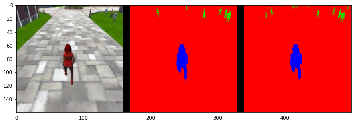
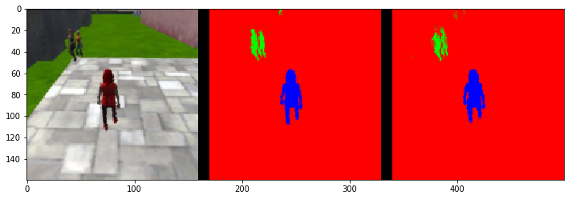
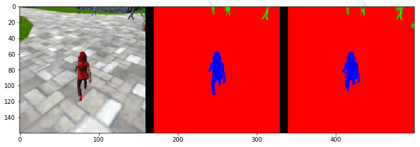
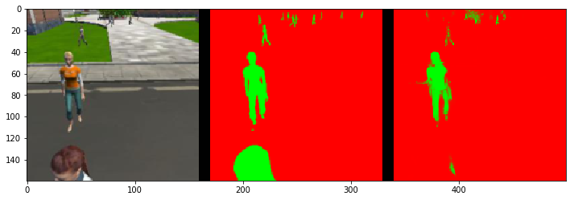
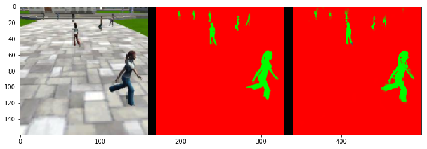
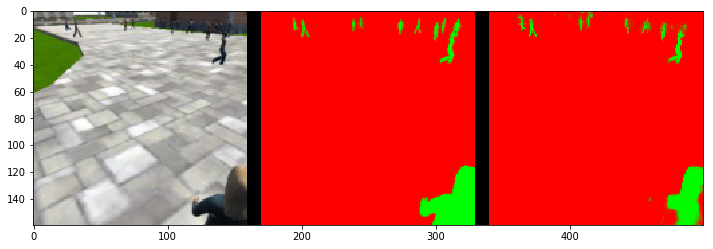
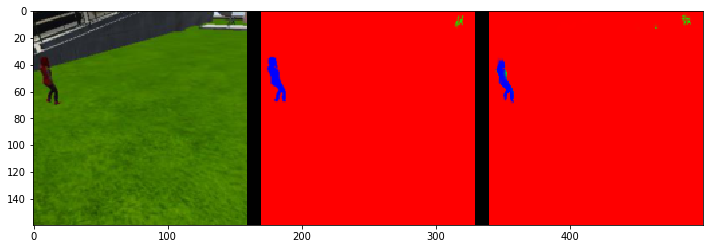
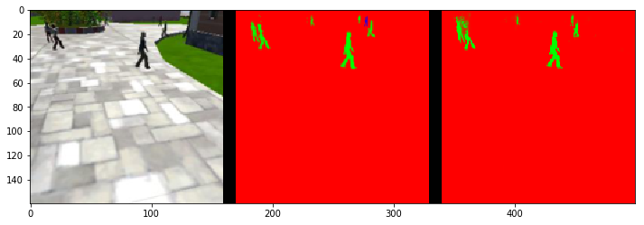
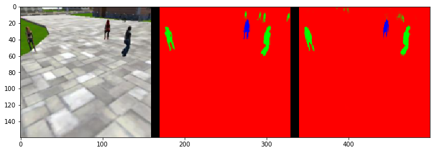

# Project : Deep Learning Follow Me

In this project we use "Fully Convolutional Network(FCN)" to track a hero from the screen using a quardcopter. This project is based on the lab "Semantic Segmentation" We use FCN for tracking the subject which is drived from "Convolutional Neural Network(CNN)". 

## Brief details on CNN

Convolutional Neural Network : A convolutional neural network (CNN, or ConvNet) is a class of deep neural networks, most commonly applied to analyzing visual imagery. A convolutional neural network consists of an input and an output layer, as well as multiple hidden layers. The hidden layers of a CNN typically consist of convolutional layers, RELU layer i.e. activation function, pooling layers, fully connected layers and normalization layers.

Convolutional: Convolutional layers apply a convolution operation to the input, passing the result to the next layer. The convolution emulates the response of an individual neuron to visual stimuli.

Pooling: Convolutional networks may include local or global pooling layers, which combine the outputs of neuron clusters at one layer into a single neuron in the next layer.

Fully connected: Fully connected layers connect every neuron in one layer to every neuron in another layer.
Receptive field: In neural networks, each neuron receives input from some number of locations in the previous layer. In a fully connected layer, each neuron receives input from every element of the previous layer. In a convolutional layer, neurons receive input from only a restricted subarea of the previous layer. Typically the subarea is of a square shape (e.g., size 5 by 5). The input area of a neuron is called its receptive field. So, in a fully connected layer, the receptive field is the entire previous layer. In a convolutional layer, the receptive area is smaller than the entire previous layer.

Weights: Each neuron in a neural network computes an output value by applying some function to the input values coming from the receptive field in the previous layer. The function that is applied to the input values is specified by a vector of weights and a bias (typically real numbers). Learning in a neural network progresses by making incremental adjustments to the biases and weights. The vector of weights and the bias are called a filter and represents some feature of the input (e.g., a particular shape). A distinguishing feature of CNNs is that many neurons share the same filter. This reduces memory footprint because a single bias and a single vector of weights is used across all receptive fields sharing that filter, rather than each receptive field having its own bias and vector of weights.

A CNN flow will look like this:

A CNN basically used for classification purpose like is this a car?. 


A Fully Convolutional Networks (FCN) don’t have any of the fully-connected layers at the end, which are typically use for classification. Instead, FCNs use convolutional layers to classify each pixel in the image.

So the final output layer will be the same height and width as the input image, but the number of channels will be equal to the number of classes. If we’re classifying each pixel as one of fifteen different classes, then the final output layer will be height x width x 15 classes.


# Data Rerording
I used the data provided in in the project.

# Project Code 

Here we describe the code added to the project.

Separable Convolutions
The Encoder for your FCN will essentially require separable convolution layers, due to their advantages as explained in the classroom. The 1x1 convolution layer in the FCN, however, is a regular convolution. Implementations for both are provided below for your use. Each includes batch normalization with the ReLU activation function applied to the layers.
```
def separable_conv2d_batchnorm(input_layer, filters, strides=1):
    output_layer = SeparableConv2DKeras(filters=filters,kernel_size=3, strides=strides,
                             padding='same', activation='relu')(input_layer)
    
    output_layer = layers.BatchNormalization()(output_layer) 
    return output_layer

def conv2d_batchnorm(input_layer, filters, kernel_size=3, strides=1):
    output_layer = layers.Conv2D(filters=filters, kernel_size=kernel_size, strides=strides, 
                      padding='same', activation='relu')(input_layer)
    
    output_layer = layers.BatchNormalization()(output_layer) 
    return output_layer
```


Bilinear Upsampling
The following helper function implements the bilinear upsampling layer. Upsampling by a factor of 2 is generally recommended, but you can try out different factors as well. Upsampling is used in the decoder block of the FCN.
```
def bilinear_upsample(input_layer):
    output_layer = BilinearUpSampling2D((2,2))(input_layer)
    return output_layer
```

Encoder Block
Create an encoder block that includes a separable convolution layer using the separable_conv2d_batchnorm() function. The filters parameter defines the size or depth of the output layer. For example, 32 or 64.
```
def encoder_block(input_layer, filters, strides):
    
    # Create a separable convolution layer using the separable_conv2d_batchnorm() function.
    output_layer = separable_conv2d_batchnorm(input_layer, filters, strides)
        
    return output_layer
```

Decoder Block
The decoder block is comprised of three parts:

A bilinear upsampling layer using the upsample_bilinear() function. The current recommended factor for upsampling is set to 2.
A layer concatenation step. This step is similar to skip connections. You will concatenate the upsampled small_ip_layer and the large_ip_layer.
Some (one or two) additional separable convolution layers to extract some more spatial information from prior layers.

```
def decoder_block(small_ip_layer, large_ip_layer, filters):
    
    # Upsample the small input layer using the bilinear_upsample() function.
    upsampled_small_ip_layer = bilinear_upsample(small_ip_layer)
    
    # Concatenate the upsampled and large input layers using layers.concatenate
    output_layer = layers.concatenate([upsampled_small_ip_layer, large_ip_layer])
    
    # Add some number of separable convolution layers
    output_layer1 = separable_conv2d_batchnorm( output_layer, filters, strides=1)
    output_layer = separable_conv2d_batchnorm( output_layer1, filters, strides=1)
    return output_layer
```

Model : Now that you have the encoder and decoder blocks ready, go ahead and build your FCN architecture!
```
def fcn_model(inputs, num_classes):
    
    # Remember that with each encoder layer, the depth of your model (the number of filters) 
    encoder1 = encoder_block(inputs, filters=64, strides=2)
    encoder2 = encoder_block(encoder1, filters=64, strides=2)
    encoder3 = encoder_block(encoder2, filters=64, strides=2)
    encoder4 = encoder_block(encoder3, filters=128, strides=2)

    # Add 1x1 Convolution layer using conv2d_batchnorm().
    onebyone_convolution_layer = conv2d_batchnorm(encoder4, filters=128, kernel_size=1, strides=1)
                                                  
    # Add the same number of Decoder Blocks as the number of Encoder Blocks
    decoder1 = decoder_block(onebyone_convolution_layer, encoder3, filters= 128)
    decoder2 = decoder_block(decoder1, encoder2, filters=64)
    decoder3 = decoder_block(decoder2, encoder1, filters=64)
    decoder4 = decoder_block(decoder3, inputs, filters=64)
    x = decoder4
    
    
    # The function returns the output layer of your model. "x" is the final layer obtained from the last decoder_block()
    return layers.Conv2D(num_classes, 1, activation='softmax', padding='same')(x)
```

# Selection of Hyper Parameters:

Batch Size: Started with a batch size of 20 and later finilize on 100.

Workers: Basically you can use the number of cores in your processor as the number of workers. In my case it was 4.

Steps Per Epoch: Basically we can approximate the number of steps per epoch by check the number of images per batch.  So for images 4131 and batch size pf 100 we approximate it to 41.

Validation Steps: Same with validation steps. With number of images 1184 and batch size 100 we approximate it to 12.

Learning Rate: I have kept the learning rate at 0.001 for the runs.

# Prediction: There are three different predictions available from the helper code provided

patrol_with_targ: Test how well the network can detect the hero from a distance.







patrol_non_targ: Test how often the network makes a mistake and identifies the wrong person as the target.







following_images: Test how well the network can identify the target while following them.







# Evaluation: Now we are going to evluate the IoU and Final score

The details of the calculation is provided here (link)[https://github.com/gauravsaxena1983/RoboND-DeepLearning-Project/blob/master/code/model_training.md#evaluation-]
